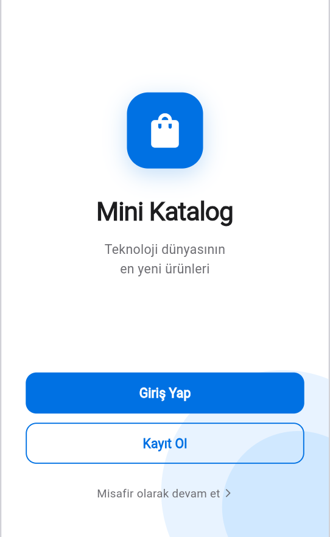
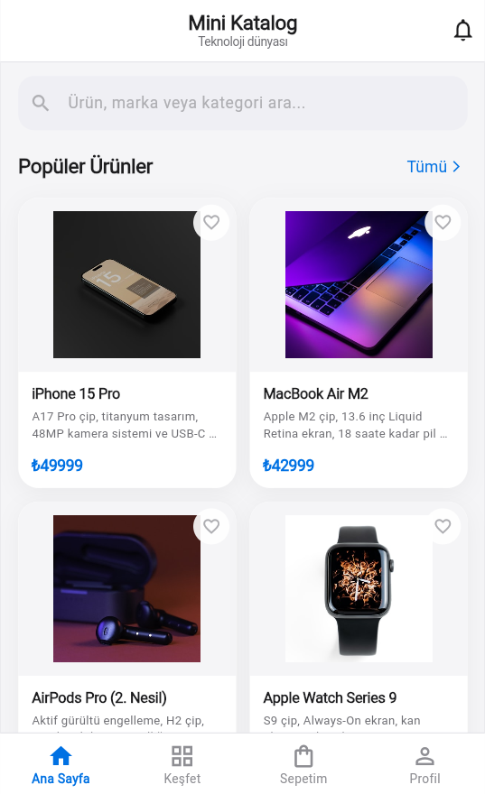
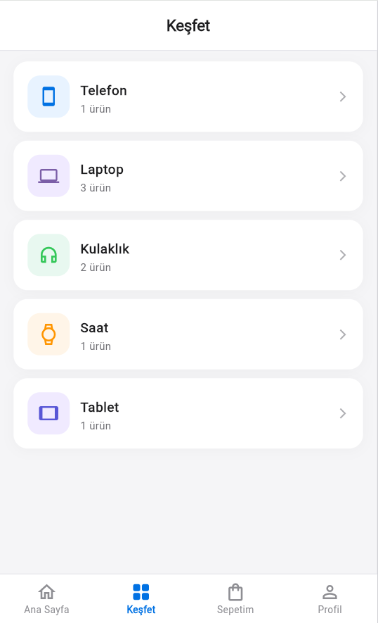
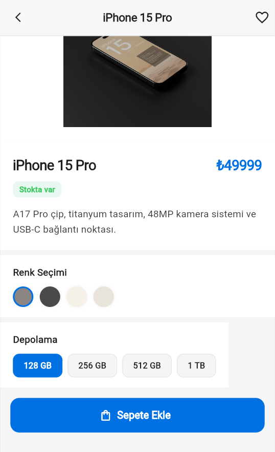
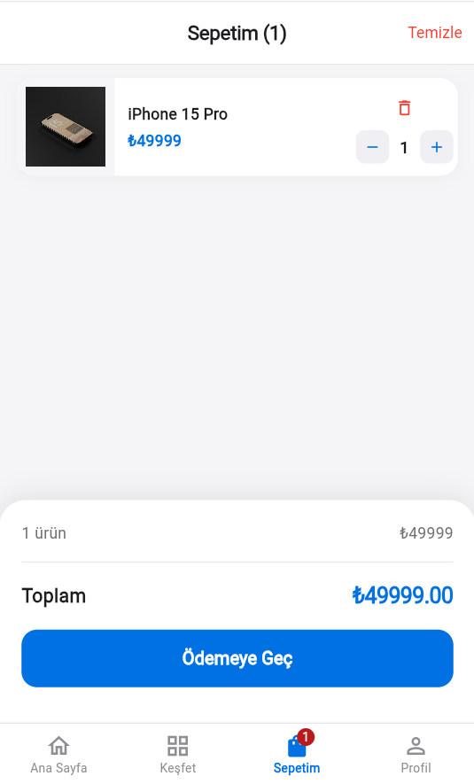
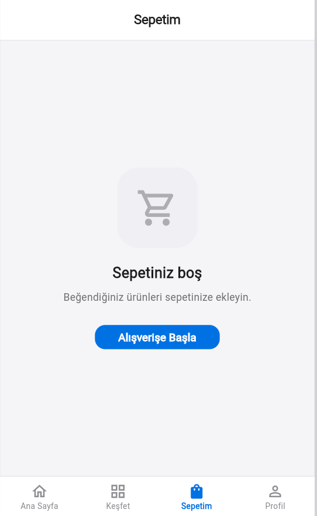

<div align="center">

# Mini Katalog Uygulaması

Teknoloji ürünleri temalı, Flutter ile geliştirilmiş modern bir mobil katalog uygulaması.


</div>

---

## Hakkında

Bu uygulama; Flutter'ın temel kavramlarını (widget ağacı, sayfa geçişleri, state yönetimi, veri modeli) pratikte uygulamak amacıyla geliştirilmiş bir mini e-ticaret kataloğudur. Mobil öncelikli tasarımıyla modern bir alışveriş uygulaması deneyimi sunar.

---

## Kullanılan Teknolojiler

| Araç | Sürüm / Detay |
|------|--------------|
| Flutter SDK | 3.41.9 (stable) |
| Dart SDK | 3.11.5 |
| IDE | Visual Studio Code |
| Platform | Android, Web (Chrome) |
| Paket | Yalnızca `material.dart` |

---

## Özellikler

- Giriş ekranı ve misafir girişi desteği
- Ürünlerin `GridView` ile 2 sütunlu listelenmesi
- Anlık arama ve kategori bazlı filtreleme
- Ürün detay sayfası (görsel, fiyat, açıklama, renk ve depolama seçimi)
- Sepet yönetimi — ürün ekleme, adet kontrolü (+/-), ürün silme, toplam fiyat
- Kategori ekranı (Telefon, Laptop, Kulaklık, Saat, Tablet)
- Profil ekranı
- `Navigator.push / pop` ile sayfa geçişleri ve route arguments
- `StatefulWidget` ile uygulama genelinde state yönetimi
- `Product.fromJson() / toJson()` ile JSON veri modeli
- Hero animasyonu ve slide geçiş efektleri

---

## Proje Klasör Yapısı

```
mini_katalog/
├── lib/
│   ├── main.dart                  # Uygulama girişi ve tema
│   ├── models/
│   │   └── product.dart           # Product modeli (fromJson / toJson)
│   ├── data/
│   │   └── product_data.dart      # Sabit ürün listesi (simülasyon verisi)
│   ├── screens/
│   │   ├── splash_screen.dart     # Karşılama / Giriş ekranı
│   │   ├── home_screen.dart       # Ana sayfa — 4 sekmeli shell
│   │   └── detail_screen.dart     # Ürün detay ekranı
│   └── widgets/
│       └── product_card.dart      # Tekrar kullanılabilir ürün kartı
├── screenshots/                   # Uygulama ekran görüntüleri
├── test/
│   └── widget_test.dart           # Smoke test
├── pubspec.yaml
└── README.md
```

---

## Kurulum ve Çalıştırma

Projeyi yerel ortamda çalıştırmak için aşağıdaki adımları takip edin.

**Gereksinimler:** Flutter 3.x, Android Emülatör veya Chrome

```bash
# Bağımlılıkları yükle
flutter pub get

# Android emülatörde çalıştır
flutter run

# Chrome'da çalıştır
flutter run -d chrome

# Kod analizi
flutter analyze
```

> Flutter `PATH`'te tanımlı değilse tam yolu kullanın:
> ```
> "C:\Users\<kullanici>\flutter\bin\flutter.bat" run
> ```

---

## Ekran Görüntüleri

| Giriş | Ana Sayfa | Keşfet |
|:-----:|:---------:|:------:|
|  |  |  |

| Ürün Detay | Sepet (Dolu) | Sepet (Boş) | Profil |
|:----------:|:------------:|:-----------:|:------:|
|  |  |  |  |

---

## Proje Amacı

Bu proje; **TNC Group Software** tarafından düzenlenen *Mobil Uygulama Geliştirme — Android/iOS Eğitimi* kapsamında hazırlanmıştır.

Eğitim boyunca öğrenilen konular pratiğe dökülmüştür:

- Stateless ve Stateful widget farkı ve kullanımı
- `Navigator.push / pop` ile çok sayfalı uygulama geliştirme
- `GridView.builder` ve `ListView.builder` ile dinamik listeler
- `fromJson / toJson` ile JSON veri modeli tasarımı
- `Map<int, int>` ile sepet state yönetimi
- Material 3 tema özelleştirmesi ve responsive tasarım

---

## Geliştirici

**Elif Tuğçe Kesler**
TNC Group Software — Mobil Uygulama Geliştirme Eğitimi, 2026

---

<div align="center">

*Demo amaçlı geliştirilmiştir. Ticari kullanım amaçlanmamıştır.*

</div>
